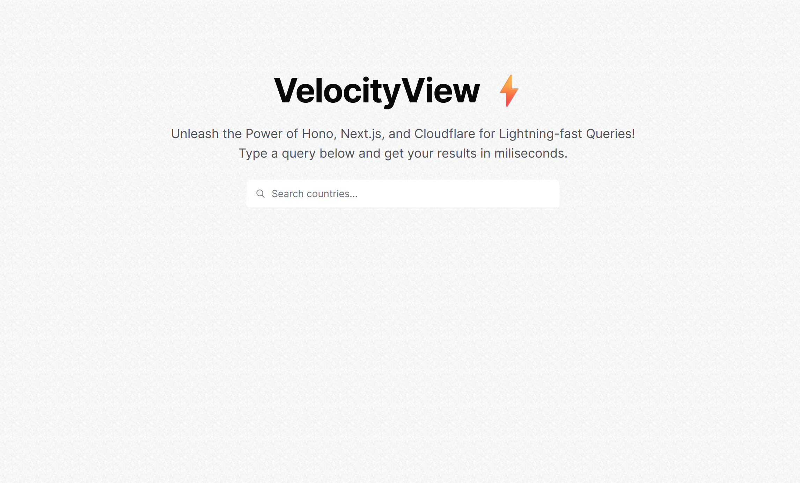
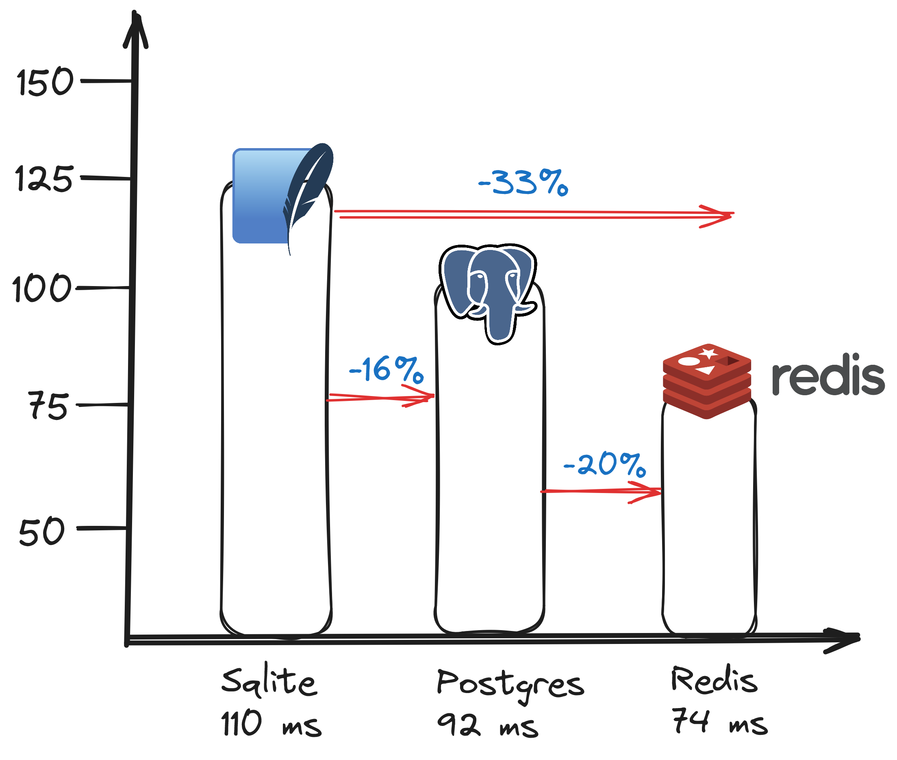
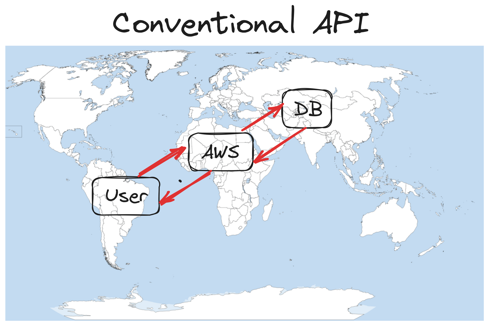
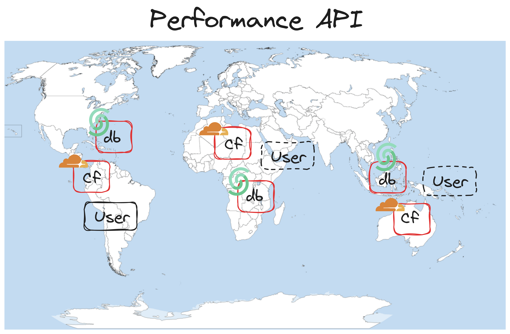

<center>

# VelocityView ⚡

</center>

<center>

**VelocityView is a high-performance API built with Hono, Next.js, and Cloudflare, designed to deliver lightning-fast query results in milliseconds.**

</center>


<center>



</center>


## 🚀 Features

- **Instant Results:** Get your query results in milliseconds.
- **Efficient:** Built with Hono, Next.js, and Cloudflare for optimal performance.
- **Scalable:** Designed to scale with your growing demands.
- **Easy Integration:** Simple integration into your existing projects.


## 💻 Overview

VelocityView utilizes a combination of cutting-edge technologies to ensure optimal performance and efficiency. The Key components include:

- **Hono:** A high-performance JavaScript framework.
- **Next.js:** The React framework for production, enabling server-side rendering and efficient client-side navigation.
- **Cloudflare:** A web infrastructure and website security company, ensuring fast and secure delivery of API responses.
- **Upstash:** A popular Redis database for storing and querying data.


## 🔗 Make a Query  (Click on this link):

```
https://performantapi.performantapi.workers.dev/api/search?q=<country_name>
```

## ➡️ Usage

1. **Send a Query:** Make a GET request to the API endpoint with your query.
```
GET /query?q=<country_name>
```
2. **Get Results:** Receive your query results instantly.

```
{
    "results": [
        // Your query results here
    ],
    "duration": <response_time_in_milliseconds>
}
```

## 📝 Installation

1. **Clone the Repository:** Clone the VelocityView repository to your local machine.

```
git clone https://github.com/AbhiiVops/NimbusAPI.git
```

2. **Install Dependencies:** Navigate to the project directory and install the required dependencies.

```
cd velocityview
```
```
npm install
```
3. **Start the Server:** Start the server to run the VelocityView API locally.

```
npm run dev
# or
yarn dev
# or
pnpm dev
# or
bun dev
```

## 📂 Files Overview

- **Page.tsx:** The main component responsible for handling user input, querying the API, and displaying results.
- **route.ts:** Defines the API routes and implements query handling logic using Hono.
- **Command.tsx:** UI component for rendering search input and displaying query results.
- **Seed.ts:** Seeds the Redis database with a list of countries to optimize search performance.

## ✅ Comparsion of average of 10 search queries with Sqlite, Postgres, and Redis



In the above image, we can see the comparison of average of 10 search queries with Sqlite, Postgres, and Redis. We can see that Redis is the fastest among all. It is because Redis is an in-memory data structure store, used as a database, cache, and message broker. It is very fast and efficient. It is also scalable and can be used in multiple regions. 

## 📝 Conventional API Queries



In conventional API, we had a user and when user makes an API Requests it does not directly hit the database. It firstly goes through some intermediate layer such as cloud functions. Then it hits the database. The database then returns the data to the cloud function. The cloud function then returns the data to the user.

*This is inefficient. We can optimize it. We can use Redis for this.*


## 📝 High Performance API Queries (VelocityView)



In Performance API, we have the same structure as the conventional API, but here we create replica of the database in every region near to the user. So, when the user makes an API Request, it directly hits the database in the region near to the user. This is efficient as it reduces the latency and increases the speed of the API.

Here we use *Redis for this. Also we are using cloudfare as a CDN and upstash as a database.*


## 📚 Resources

- [Hono Documentation](https://hono.dev/docs)
- [Hono Documentation](https://hono.dev/docs)
- [GitHub Gist](https://gist.github.com/incredimike/1469814)
- [NPM Package: Hono](https://www.npmjs.com/package/hono)
- [NPM Package: Wrangler](https://www.npmjs.com/package/wrangler)
- [Cloudflare](https://www.cloudflare.com/)

## 📝 Conclusions

- **VelocityView is a high-performance API built with Hono, Next.js, and Cloudflare, designed to deliver lightning-fast query results in milliseconds.**
- **The key components of VelocityView include: Hono, Next.js, Cloudflare, and Upstash.**
- **The API is designed to be scalable, efficient, and easy to use.**


